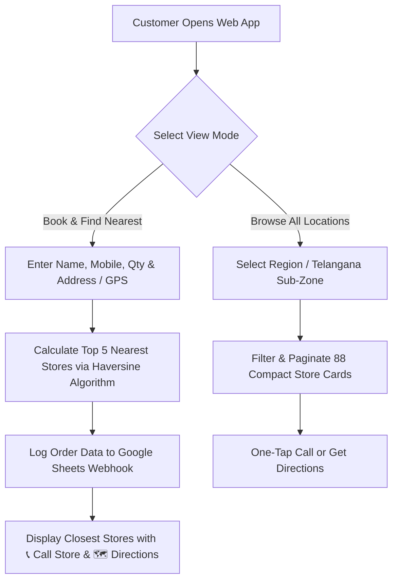

# 🪔 Ganesh Puja Kits - Store Pickup Web Application

An initiative by **Badyatha Foundation** promoting eco-friendly clay Ganesh idols and authentic organic Puja Kits across **Telangana**, **Andhra Pradesh**, **Karnataka**, and **Maharashtra**.

A lightweight, high-performance, mobile-first web application designed for reserving complete Ganesh Puja Kits online in 30 seconds with direct store pickup at 88 verified pickup centers.

---

## 🛠️ Technology Stack & APIs

* **Frontend Architecture**: HTML5, Vanilla CSS3 (Custom Design System, Glassmorphism, CSS Grid & Flexbox), Vanilla JavaScript (ES6+).
* **Mapping & Geolocation APIs**:
  * **Primary Address Autocomplete**: **[LocationIQ API](https://locationiq.com)** (`countrycodes=in` filtered for high-precision Indian address lookup).
  * **Fallback Address Autocomplete**: **[OpenStreetMap (Photon API)](https://photon.komoot.io)**.
  * **Reverse Geocoding**: LocationIQ + OSM Nominatim API for 1-click GPS location detection.
  * **Distance Engine**: Custom **Haversine Distance Algorithm** implemented in `app.js` for real-time kilometer calculations.
* **Backend & Database**:
  * **Google Sheets Webhook API**: Live order logging via a serverless Google Apps Script (`google_script_template.js`) receiving `POST` payloads.
  * **Default Google Sheet Webhook Endpoint**: `https://script.google.com/macros/s/AKfycbyZcR8RClyRo_jpeCEPqk6W9wiFHtroy1nHuAtPL_eW-QRYa-8v4T4HqIBUA3b69kI/exec`
* **Media & Asset Optimization**:
  * **Event Banner Poster (`poster.webp`)**: Compressed and edited into modern **WebP format via ChatGPT AI image editing**, achieving a **91% file size reduction** (from 2.1 MB down to 193 KB) for sub-second mobile page loads.

---

## 🌟 Key Features

1. **Mobile-First Responsive Design**:
   * Optimized for smartphone viewports with touch-friendly action buttons, numeric keypads, and zero horizontal scrolling overflow.

2. **Nearest Store Calculation Engine**:
   * Calculates distance between customer address and 88 store coordinates in real-time using the Haversine formula.
   * Renders the **Top 5 Nearest Stores** sorted by proximity.

3. **Segmented Side-by-Side View Navigation**:
   * Smooth tab switching between **`Book & Find Nearest Stores`** and **`Browse All Locations`**.

4. **Multi-Row Region & Hyderabad Sub-Zone Filter Chips**:
   * **State Filters**: Telangana / Hyd (75), Andhra Pradesh (9), Karnataka (1), Maharashtra (2).
   * **Hyderabad Sub-Zone Filters** *(shown when Telangana is selected)*:
     * 📍 **West Hyd** (*Kukatpally, Miyapur, Bachupally, Nizampet, KPHB*)
     * 📍 **IT Corridor** (*Gachibowli, Kondapur, Madhapur, Manikonda, Kokapet*)
     * 📍 **Central** (*Banjara Hills, Panjagutta, SR Nagar, Somajiguda, Tarnaka*)
     * 📍 **East Hyd** (*LB Nagar, Uppal, Dilsukhnagar, Boduppal, Nacharam*)
     * 📍 **North Hyd** (*Alwal, Kompally, Malkajgiri, ECIL, AS Rao Nagar*)
     * 🌆 **Other Telangana Cities** (*Warangal, Nalgonda, Siddipet, Karimnagar, Choutuppal, Chityal, Suryapet, Kodad*)

5. **Space-Saving Compact Store Cards & Action Buttons**:
   * **`📞 Call Store`**: One-tap direct call (`tel:` protocol).
   * **`🗺️ Directions`**: Opens Google Maps navigation directly to the store coordinates.

6. **Batch Pagination**:
   * Renders stores in clean batches of 12 per page with page numbers to prevent infinite scrolling.

7. **Hidden Admin Dashboard & Excel Export**:
   * Access via top-right 🔒 icon (*Passcode protected*).
   * **📥 Download Excel (.CSV)**: Instant download of all orders for offline management.
   * Configurable Google Sheets Webhook URL.

---

## 🔄 User Workflow



---

## 🚀 How to Run Locally

```bash
# Option 1: Using Python built-in server
python3 -m http.server 8080

# Option 2: Using npx http-server
npx http-server ./
```
Open `http://localhost:8080` in your browser.

---

## ☁️ How to Deploy for Free on Vercel

1. Push your code to GitHub:
   ```bash
   git add .
   git commit -m "Updated README with complete project architecture"
   git push origin main
   ```
2. Go to **[vercel.com/new](https://vercel.com/new)**.
3. Import repository **`vjjayanth/ganeshpujakit`** and click **Deploy**!

---

## 📜 Credits & Acknowledgments

* **Initiated & Organized by**: **Badyatha Foundation**
* **Repository**: [github.com/vjjayanth/ganeshpujakit](https://github.com/vjjayanth/ganeshpujakit)